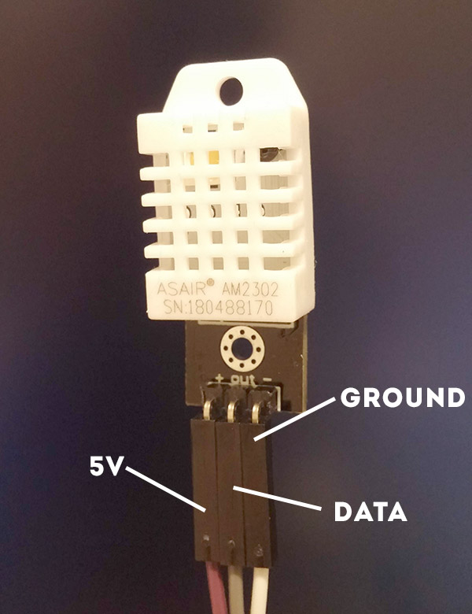

# Raspberry Pi Temperature Sensor

This project creates a temperature and humidity sensor that exports metrics in Prometheus format.

## Hardware Requirements

- Raspberry Pi Zero 2 W
- AM2302 (DHT22) Temperature/Humidity Sensor
- MicroSD card (8GB or larger)
- Power supply (5V, 2A recommended)

## Sensor & Wiring Guide
Originally used the [DHT11](https://www.amazon.com/gp/product/B01H3J3H82/) but wanted something more accurate so went with [AM2302 Temperature & Humidity Sensor](https://www.amazon.com/gp/product/B073F472JL) or a [4 Pack](https://www.amazon.com/dp/B0FCLX5GTZ)

### Wiring Guide

Connect the AM2302 sensor to your Raspberry Pi:
```
AM2302 Sensor → Raspberry Pi Zero 2 W
----------------------------------------
VCC (Pin 1)   → 5V (Pin 1)
DATA (Pin 2)  → GPIO 14 (Pin 8)
GND (Pin 3)   → Ground (Pin 6)
```

[Raspberry Pi Pin Layout Guide](https://pinout.xyz/)
<details>
<summary> AM2302 Diagram</summary>



</details>

## Software Installation

### Step 1: Flash Raspberry Pi OS

1. Download & install [Raspberry Pi Imager](https://www.raspberrypi.com/software/)
2. Insert your microSD card
3. In Raspberry Pi Imager:
  - **Device:** Raspberry Pi Zero 2 W
  - **OS:** Raspberry Pi OS Lite (64-bit) (in Raspberry Pi OS (other))
  - **Storage:** Your SD card
  - **Customization:**
    - **Hostname:** `sensor-pi` (should be unique for each device as we will reference this later)
    - **Localization:** (optional)
    - **User:**
      - Username: `pi`
      - Password: [choose a secure password]
    - **Wi-Fi:**
      - Choose network type (secure or open)
      - SSID: [2.4 Ghz wifi network name]
      - Password: [wifi password]
    - **Remote access:** Enable SSH & use password authentication

4. Click **WRITE** to start

### Step 2: Boot and Wait

1. Insert the SD card into your Raspberry Pi Zero 2 W
2. Connect power
3. Wait 2-5 minutes for first boot (it takes a while!)
4. Check your router for the device's IP address

### Step 3: Run Automated Setup

SSH into your Pi:
```bash
ssh pi@sensor-pi.local
# pi@<hostname>.local
# Or use IP address: ssh pi@192.168.x.x
```

Then run the automated setup:
```bash
curl -L https://raw.githubusercontent.com/jveldboom/raspberry-pi-temperature-system/main/setup.sh | bash
```

The installation takes 5-10 minutes and will:
- Update the system
- Install required dependencies
- Install the sensor script
- Create and start the systemd service
- Configure automatic startup on boot

## Verification

### Check if the sensor is running:
```bash
sudo systemctl status temp-sensor
```

You should see `Active: active (running)` in green.

### View real-time sensor readings:
```bash
sudo journalctl -u temp-sensor -f
```

You should see output like:
```
Temp: 72.5°F, Humidity: 45.2%
```

### Check Prometheus metrics:
```bash
curl http://localhost:8000/metrics
```

You should see:
```
# HELP temperature_fahrenheit Temperature in Fahrenheit
# TYPE temperature_fahrenheit gauge
temperature_fahrenheit 72.5
# HELP humidity_percent Humidity percentage
# TYPE humidity_percent gauge
humidity_percent 45.2
```

### Test from another device:

From your computer, open a browser and go to:
```
http://<HOSTNAME>.local:8000/metrics
```

Or use the IP address:
```
http://192.168.x.x:8000/metrics
```

## Configuration

### Change GPIO Pin

If your sensor is connected to a different GPIO pin, edit the script:
```bash
nano /home/pi/temp-sensor.py
```

Change this line:
```python
"gpioPin": 14,  # update to match your wiring
```

Then restart the service:
```bash
sudo systemctl restart temp-sensor
```

### Change Sensor Type

If you're using a different sensor (DHT11 or DHT22 instead of AM2302):
```bash
nano /home/pi/temp-sensor.py
```

Change this line:
```python
"sensor": Adafruit_DHT.AM2302,  # Change to DHT11 or DHT22 if needed
```

Options:
- `Adafruit_DHT.DHT11`
- `Adafruit_DHT.DHT22`
- `Adafruit_DHT.AM2302`

### Change Metrics Port

To change the port from 8000 to something else:
```bash
nano /home/pi/temp-sensor.py
```

Change:
```python
"port": 8000,  # Change to your desired port
```

Then restart:
```bash
sudo systemctl restart temp-sensor
```

## Integrating with Prometheus

Add this to your `prometheus.yml`:
```yaml
scrape_configs:
  - job_name: 'raspberry-pi-sensor'
    static_configs:
      - targets: ['sensor-pi.local:8000']
        labels:
          location: 'living_room'  # customize as needed
```

## Troubleshooting

### Service won't start
```bash
# Check service status
sudo systemctl status temp-sensor

# View detailed logs
sudo journalctl -u temp-sensor -n 50

# Check for errors
sudo journalctl -u temp-sensor --since today
```

### Getting "Failed to get reading" errors

- Check your wiring connections
- Verify GPIO pin number in config
- Make sure sensor has power (3.3V or 5V depending on sensor)
- Try adding a small delay between readings (already set to 10 seconds)

### Can't access metrics from another device
```bash
# Check if service is listening on all interfaces
sudo netstat -tuln | grep 8000

# Check firewall (usually not an issue on Raspberry Pi OS)
sudo ufw status
```

### Python library issues

If you get import errors, try installing via apt instead:
```bash
sudo apt install -y python3-adafruit-dht
```

## Useful Commands
```bash
# View live sensor output
sudo journalctl -u temp-sensor -f

# Restart service
sudo systemctl restart temp-sensor

# Stop service
sudo systemctl stop temp-sensor

# Start service
sudo systemctl start temp-sensor

# Disable autostart
sudo systemctl disable temp-sensor

# Re-enable autostart
sudo systemctl enable temp-sensor

# Edit sensor script
nano /home/pi/temp-sensor.py

# Test script manually (stop service first)
sudo systemctl stop temp-sensor
python3 /home/pi/temp-sensor.py
```

## Support

If you encounter issues, check the logs first:
```bash
sudo journalctl -u temp-sensor -n 100
```

Common issues are usually:
- Incorrect wiring
- Wrong GPIO pin in configuration
- Sensor not receiving power
- Bad sensor (try a different one)
